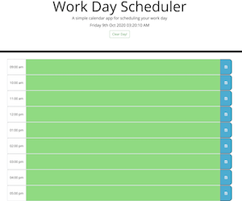
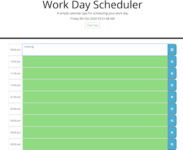
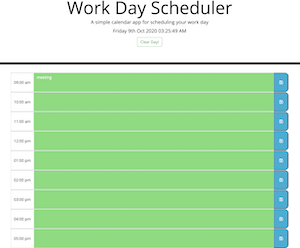

# Daily Calendar.

## About The Project.

    The purpose of this project is to create a simple calendar application that allows a user to save events for each hour of the day by modifying starter code. This app will run in the browser and feature dynamically updated HTML and CSS powered by jQuery.

    This project is using Moment.js library (third party APIs) to display current date and time in the browser.

## Project Criteria.

* This project presents the daily planner to create a schedule with time blocks for standard business hours; 09.00am - 05.00pm.  

      

*  The project using Moment.js library (third party APIs) to display current date and time in the browser, which the time block is color-coded to indicate whether it is in the past (grey color), present (red color) or future (green color). 
*  The user will be able to enter an event in each time block and click save the event. Once the user refresh the page, the saved events persist.  
  

## How to Create The Project.
* Create HTML file containing the webpage details, such as Jumbotron for header, time blocks, etc.
* Create CSS file to style the webpage
* Create JS file to dynamically updated HTML and CSS powered by jQuery.  
    -  Crete variable for Moment.js to display current date and time in the browser.
    -  Using jQuery to target the Id from textarea in HTML.
    -  Create empty variables for user input.
    -  Using setInterval function to display current date and time. 
    -  Using JSON.parse to get data from local storage as a JS object and return value using .val() method. 
    -  Using .each function with jQuery selector to changing color on textarea follow the current time.
    -  Add click function to save buttons, to store input in Local storage.
    -  Create clear button to delete unwanted saved events.

## Author   
-  Suthunya Purciful (Sai)

## License
-  Not Available
 
## Link to deployed project.  
- https://saipurciful.github.io/DailyCalendar/

    
